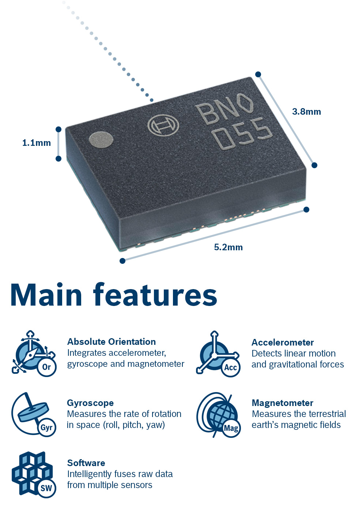

## Bosch Sensortec BNO055 embedded-hal driver

[](https://crates.io/crates/bno055)
[](https://docs.rs/bno055/)
[](https://crates.io/crates/bno055)



## What is this?

This is a [embedded-hal](https://github.com/rust-embedded/embedded-hal) driver
for Bosch's Absolute Orientation Sensor [BNO055](https://ae-bst.resource.bosch.com/media/_tech/media/datasheets/BST-BNO055-DS000.pdf).

It is device-agnostic and uses embedded-hal's `Write`/`WriteRead` (for I2C)
and `Delay` traits for its operation.

Uses and re-exports [mint](https://crates.io/crates/mint)'s
[Quaternion](https://docs.rs/mint/0.5.1/mint/struct.Quaternion.html) for quaternion reading
and [EulerAngles](https://docs.rs/mint/0.5.1/mint/struct.EulerAngles.html) for Euler angles
and [Vector3](https://docs.rs/mint/0.5.1/mint/struct.Vector3.html) for sensor readings.

## Usage notes
### Important note on I2C issues
As [noted e.g. by Adafruit](https://learn.adafruit.com/adafruit-bno055-absolute-orientation-sensor) the sensor has issues
with its I2C implementation, which causes it to not work correctly with certain microcontrollers.

This seems to be caused by clock stretching, thus running at lower I2C speeds and with increased I2C timeouts should
resolve the issue.

### Initial startup delay
The sensor has an initial startup time during which interaction with it will fail.
As per [the documentation](https://www.bosch-sensortec.com/media/boschsensortec/downloads/datasheets/bst-bno055-ds000.pdf)
this is in the 400ms - 650ms range (consult chapter 1.2 / page 14 for further details).
If your microcontroller is faster in starting up you might have to delay before talking to the sensor (or retry on failure).

## Feature flags

### `std`

By default, this crate is `no_std` compatible. However, you can enable `std` features by enabling the `std` feature flag.
At the moment this only adds `std::error::Error` trait implementation for the `Error` type.

### `serde`

The `serde` flag adds implementation of `Serialize` / `Deserialize` to `BNO055Calibration`.

**Note:** `serde` itself is `no_std` compatible, however not all serializers are (e.g. `serde-json` is not but `serde-json-core` is),
so be careful that you're not enabling `serde`'s `std` feature by accident (see [here](https://serde.rs/no-std.html#no-std-support) for a complete explanation).

## Usage

1. Add a dependency to `Cargo.toml`:

    ```bash
    cargo add bno055
    ```

2. Instantiate and init the device:

    ```rust
    // ... declare and configure your I2c and Delay implementations ...
    // let i2c = ...;
    // let delay = ...;

    // Init BNO055 IMU
    let mut imu = bno055::Bno055::new(i2c);

    imu.init(&mut delay)?;

    // Enable 9-degrees-of-freedom sensor fusion mode with fast magnetometer calibration
    imu.set_mode(bno055::BNO055OperationMode::NDOF, &mut delay)?;

    Ok(imu)
    ```

3. Read orientation data, quaternion or euler angles (roll, pitch, yaw/heading):

    ```rust
    let quat: mint::Quaternion<f32> = imu.quaternion()?;
    // or:
    let euler: mint::EulerAngles<f32, ()> = imu.euler_angles()?;
    ```

    >Due to the BNO055 firmware bugs, the Euler angles reading shouldn't be relied on.
    I recommend to stick with quaternion readings and convert them to the Euler angles later if needed.

## Details and examples

### Device calibration

To calibrate the device's sensors for first time:

```rust
use bno055::{BNO055Calibration, BNO055OperationMode, BNO055_CALIB_SIZE};

let bno055 = ...;

// Enter NDOF (absolute orientation) sensor fusion mode which is also performing
// a regular sensors calibration
bno055.set_mode(BNO055OperationMode::NDOF)?;

// Wait for device to auto-calibrate.
// Please perform steps necessary for auto-calibration to kick in.
// Required steps are described in Datasheet section 3.11
while !bno055.is_fully_calibrated() {}

let calib = bno055.calibration_profile()?;

// Save calibration profile in NVRAM
mcu.nvram_write(BNO055_CALIB_ADDR, calib.as_bytes(), BNO055_CALIB_SIZE)?;
```

To load a previously saved calibration profile:

```rust
use bno055::{BNO055Calibration, BNO055OperationMode, BNO055_CALIB_SIZE};

let bno055 = ...;

// Read saved calibration profile from MCUs NVRAM
let mut buf = [0u8; BNO055_CALIB_SIZE];
mcu.nvram_read(BNO055_CALIB_ADDR, &mut buf, BNO055_CALIB_SIZE)?;

// Apply calibration profile
let calib = BNO055Calibration::from_buf(buf);
bno055.set_calibration_profile(calib)?;
```

### Remapping of axes to correspond your mounting

BNO055 allows to change default axes to meet the chip orientation with
an actual physical device orientation, thus providing possibility to place BNO055
chip on PCB as suitable for the designer and to match the chip's axes to physical
axes in software later.

```rust
use bno055::{AxisRemap, BNO055AxisConfig};
// ...

// Build remap configuration example with X and Y axes swapped:
let remap = AxisRemap::builder()
    .swap_x_with(BNO055AxisConfig::AXIS_AS_Y)
    .build()
    .expect("Failed to build axis remap config");

bno055.set_axis_remap(remap)?;
```

Please note that `AxisRemap` builder (and the chip itself) doesn't allow an invalid state to be constructed,
that is, when one axis is swapped with multiple of others.
For example, swapping axis `X` with both `Y` and `Z` at the same time is not allowed:

```rust
AxisRemap::builder()
    .swap_x_with(BNO055AxisConfig::AXIS_AS_Y)
    .swap_x_with(BNO055AxisConfig::AXIS_AS_Z)
    .build()
    .unwrap(); // <- panics, .build() returned Err
```

### Changing axes sign

It is also possible to flip the sign of either axis of the chip.

Example of flipping X and Y axes:

```rust
bno055
    .set_axis_sign(BNO055AxisSign::X_NEGATIVE | bno055::BNO055AxisSign::Y_NEGATIVE)
    .expect("Unable to communicate");
```

### Using external 32k crystal

For better performance, it is recommended to connect and use external 32k quartz crystal.

You enable or disable its use by calling `set_external_crystal`:

```rust
bno055
    .set_external_crystal(true)
    .expect("Failed to set to external crystal");
```

### Using alternative I2C address

BNO055 allows to change its I2C address from default `0x29` to alternative `0x28` by setting
`COM3` pin `LOW`.

To connect to device with an alternative address, enable its use by calling `with_alternative_address()`:

```rust
// use default 0x29 address
let mut bno = bno055::Bno055::new(i2c);

// or:

// use 0x28 address
let mut bno = bno055::Bno055::new(i2c).with_alternative_address();
```

### Change BNO055 power mode

```rust
use bno055::{Bno055, BNO055PowerMode};
// Normal mode
bno055.set_power_mode(BNO055PowerMode::NORMAL)?;

// Low-power mode (only accelerometer being awake)
bno055.set_power_mode(BNO055PowerMode::LOW_POWER)?;

// Suspend mode (all sensors and controller are sleeping)
bno055.set_power_mode(BNO055PowerMode::SUSPEND)?;
```

### Read chip temperature

Temperature is specified in degrees Celsius by default.

```rust
let temp: i8 = bno055.temperature()?;
```

## Status

What is done and tested and what is not yet:

- [x] Sensor initialization
- [x] Device mode setup
- [x] Device status readout
- [x] Calibration status readout
- [x] External crystal selection
- [x] Axis remap
- [x] Axis sign setup
- [x] Calibration data readout
- [x] Calibration data setup
- [x] Alternative I2C address
- [x] Take register pages into account
- [x] Orientation data readout
    - [x] Quaternions
    - [x] Euler angles
- [x] Raw sensor data readout
    - [x] Raw accelerometer data readout
    - [x] Raw gyroscope data readout
    - [x] Raw magnetometer data readout
- [x] Linear acceleration data readout
- [x] Gravity vector data readout
- [x] Temperature readout
- [ ] Per-sensor configuration (when not in fusion mode)
- [ ] Unit selection
- [ ] Interrupts

License: MIT.

**Contributions welcomed!**
